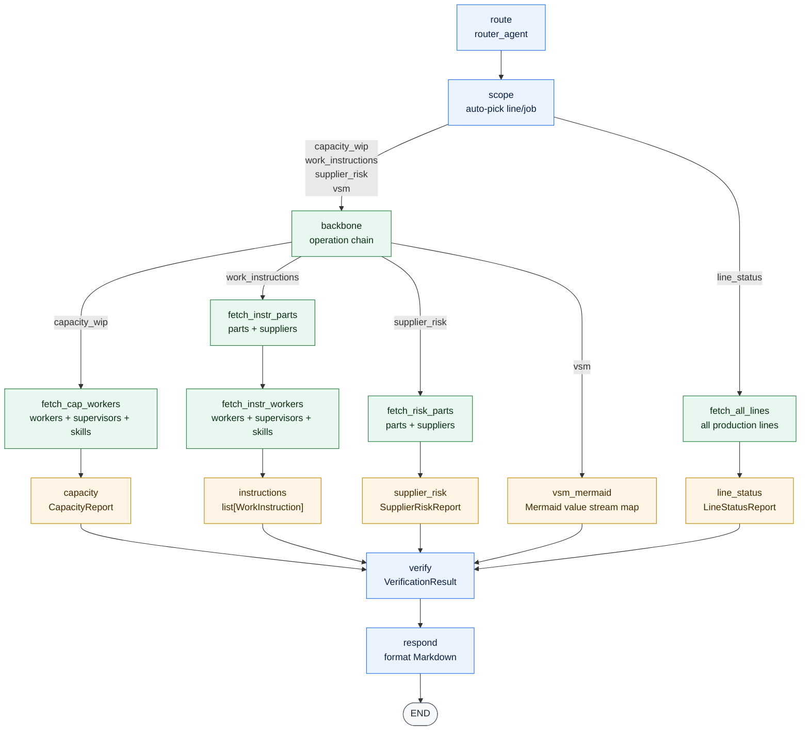
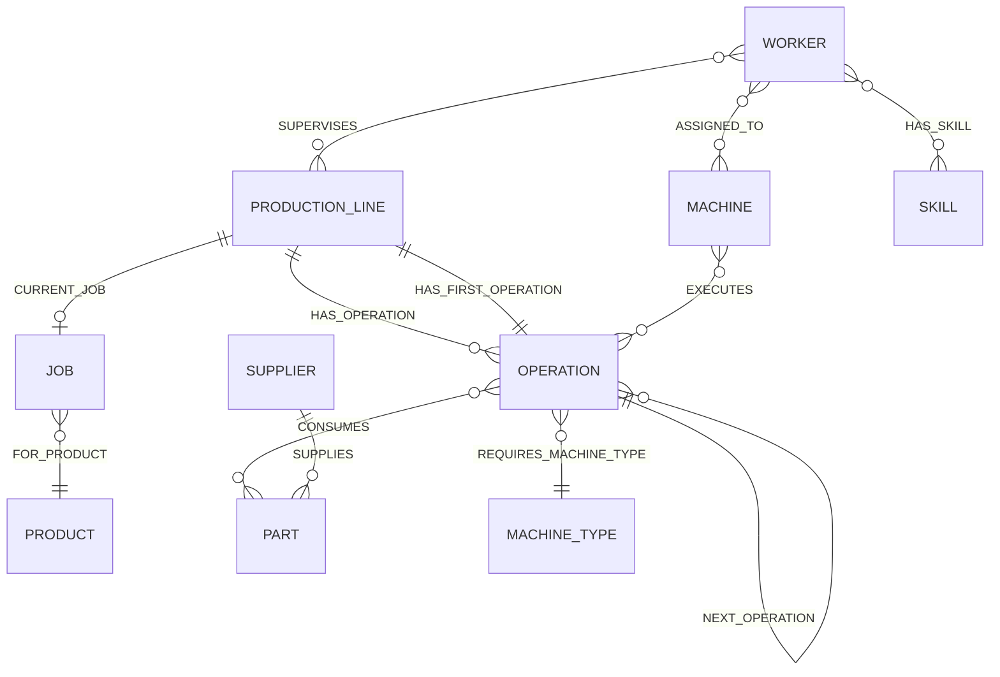
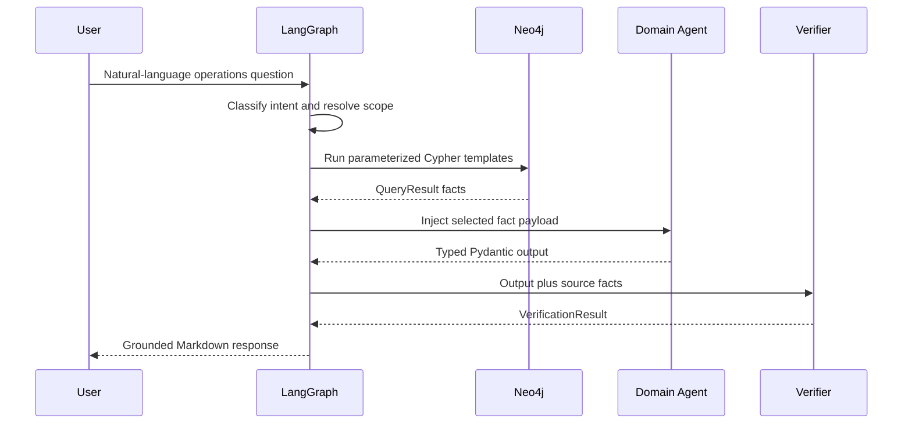

# BOM360 GraphRAG Multi-Agent System

[](https://www.python.org/)
[](https://www.langchain.com/langgraph)
[](https://ai.pydantic.dev/)
[](https://neo4j.com/)
[](https://mermaid.js.org/)

BOM360 is a manufacturing GraphRAG system that routes natural-language operations
questions through a LangGraph workflow, retrieves grounded production facts from
Neo4j, runs the facts through specialized PydanticAI analysts, and verifies the
final answer against the source graph data.

The project is designed around one core constraint: agents do not invent Cypher.
Every graph query is a version-controlled, parameterized template, and every
agent response is checked against the retrieved facts before it is returned.

## Contents

- [System At A Glance](#system-at-a-glance)
- [LangGraph Workflow](#langgraph-workflow)
- [Intent Routing](#intent-routing)
- [Agent Contracts](#agent-contracts)
- [Neo4j Query Surface](#neo4j-query-surface)
- [Examples](#examples)
- [Run Locally](#run-locally)
- [Repository Structure](#repository-structure)

## System At A Glance

```mermaid
flowchart LR
    user["Plant supervisor<br/>Operations manager"] --> entry["CLI or<br/>LangGraph Studio"]
    entry --> workflow["LangGraph<br/>StateGraph"]

    workflow --> router["Router agent<br/>intent classifier"]
    router --> scope["Scope resolver<br/>line_id + job_id"]

    scope --> cypher["Parameterized<br/>Cypher templates"]
    cypher --> neo4j[("Neo4j<br/>BOM360 graph")]
    neo4j --> facts["QueryResult facts<br/>rows + query audit"]

    facts --> analysts["Domain analyst agents<br/>typed Pydantic outputs"]
    analysts --> verifier["Verifier agent<br/>fact consistency check"]
    verifier --> response["Grounded response<br/>Markdown + structured data"]

    classDef graphNode fill:#eaf3ff,stroke:#1f6feb,color:#0b1f3a;
    classDef dataNode fill:#e8f7ef,stroke:#1a7f37,color:#0b2e13;
    classDef aiNode fill:#fff4e5,stroke:#bf8700,color:#3d2b00;
    classDef outNode fill:#f6f8fa,stroke:#57606a,color:#24292f;

    class workflow,router,scope graphNode;
    class cypher,neo4j,facts dataNode;
    class analysts,verifier aiNode;
    class user,entry,response outNode;
```

<details open>
<summary><strong>GitHub-native architecture diagram</strong></summary>



</details>

## LangGraph Workflow

The workflow is implemented in [`src/workflows.py`](src/workflows.py). It uses
shared entry and verification nodes, then branches into intent-specific data
fetching and analyst paths.

<details open>
<summary><strong>Executable workflow topology</strong></summary>



</details>

## Intent Routing

The router maps each user request to one of five intent tokens. Each intent gets
only the graph facts it needs, which keeps prompts small and audit trails clear.

| Intent | Example request | Data fetched | Analyst output |
| --- | --- | --- | --- |
| `line_status` | "What is the status of our production lines?" | All production lines and running operations | `LineStatusReport` |
| `capacity_wip` | "Where are the bottlenecks today?" | Operation backbone, workers, supervisors, skill coverage | `CapacityReport` |
| `work_instructions` | "Generate work instructions for the current assembly job." | Operation backbone, parts, suppliers, workers | `list[WorkInstruction]` |
| `supplier_risk` | "Are there supplier risks on this job?" | Operation backbone, parts, suppliers | `SupplierRiskReport` |
| `vsm` | "Create a value stream map for this line." | Operation backbone | Mermaid flowchart string |

## Agent Contracts

The agents are defined in [`src/agents.py`](src/agents.py), their prompts live in
[`src/prompts.py`](src/prompts.py), and their structured contracts live in
[`src/models.py`](src/models.py).

| Agent | Responsibility | Guardrail |
| --- | --- | --- |
| Router | Classifies the user goal into one exact intent token | Literal output type prevents unsupported routes |
| Capacity analyst | Finds WIP, bottlenecks, staffing gaps, due-date risks | Uses only backbone, worker, supervisor, and skill facts |
| Work instruction writer | Produces operation-level shop-floor instructions | References only provided machines, parts, workers, and dates |
| Supplier risk analyst | Flags lead-time, reliability, and single-source risk | Uses supplier and part facts from Neo4j |
| Line status analyst | Summarizes current production-line state | Computes status from line and job quantities |
| Mermaid VSM agent | Generates a value stream map from operations | Output is lightly checked for valid Mermaid structure |
| Verifier | Compares generated output against source facts | Flags hallucinated IDs, names, dates, and numeric values |

## Neo4j Query Surface

BOM360 uses explicit Cypher templates instead of letting an LLM write database
queries at runtime. The templates in [`src/cypher_templates.py`](src/cypher_templates.py)
return `(cypher, params)` pairs, and [`Neo4jClient.run()`](src/neo4j_client.py)
wraps each result in a `QueryResult` for auditability.

<details open>
<summary><strong>Graph model touched by the query templates</strong></summary>



</details>

<details>
<summary><strong>Fact flow from Neo4j to verified response</strong></summary>



</details>

## Examples

<details>
<summary><strong>Line status</strong></summary>

```text
What is the status of our production lines?
```

Routes to `line_status`, fetches all production lines, calculates completion
percentages, identifies the current operation, and flags lines at risk.

</details>

<details>
<summary><strong>Capacity and WIP</strong></summary>

```text
Where are the bottlenecks on the most urgent job?
```

Routes to `capacity_wip`, pulls the operation backbone, worker assignments,
supervisors, and skill coverage, then returns bottlenecks, staffing gaps,
due-date risks, and recommended actions.

</details>

<details>
<summary><strong>Supplier risk</strong></summary>

```text
Are there supplier risks we should address before this job ships?
```

Routes to `supplier_risk`, retrieves consumed parts and supplier metadata, then
flags reliability, lead-time, and single-source risks.

</details>

<details>
<summary><strong>Work instructions</strong></summary>

```text
Generate work instructions for the current assembly job.
```

Routes to `work_instructions`, pulls operations, parts, suppliers, and workers,
then creates operation-level instructions with checkpoints and definitions of
done.

</details>

<details>
<summary><strong>Value stream map</strong></summary>

```text
Create a value stream map for the current line.
```

Routes to `vsm`, retrieves the ordered operation backbone, and returns a Mermaid
flowchart that can be rendered directly in Markdown.

</details>

## Run Locally

### 1. Install the package

```powershell
python -m venv .venv
.\.venv\Scripts\Activate.ps1
pip install -e .
```

### 2. Configure environment variables

Create a `.env` file in the repository root:

```dotenv
NEO4J_URI=bolt://localhost:7687
NEO4J_USER=neo4j
NEO4J_PASSWORD=your-password
NEO4J_DB=neo4j

# Match the provider and model you want PydanticAI to use.
LLM_MODEL=anthropic:claude-sonnet-4-20250514
ANTHROPIC_API_KEY=your-api-key
```

### 3. Run the CLI

```powershell
python -m src.app "What is the status of our production lines?"
python -m src.app "Are there supplier risks we should address?"
python -m src.app "Generate work instructions for the current assembly job."
```

After `pip install -e .`, the project script is also available:

```powershell
bom360 "Where are the bottlenecks today?"
```

### 4. Run in LangGraph Studio

The graph is exposed through [`langgraph.json`](langgraph.json):

```powershell
langgraph dev
```

## Repository Structure

```text
.
|-- README.md
|-- langgraph.json
|-- pyproject.toml
|-- neo4j-2026-02-18T21-54-21.dump
`-- src
    |-- agents.py             # PydanticAI agent definitions
    |-- app.py                # CLI entry point
    |-- cypher_templates.py   # Parameterized Neo4j query templates
    |-- models.py             # Pydantic state and output contracts
    |-- neo4j_client.py       # Thin Neo4j driver wrapper
    |-- prompts.py            # System prompts for all agents
    |-- studio.py             # LangGraph Studio entry point
    `-- workflows.py          # LangGraph topology and node functions
```

## Design Notes

- The workflow keeps database access outside the agents.
- The same verifier sink checks every agent path before response formatting.
- `AppState` stores retrieved facts and typed outputs together, so each run can
  be audited from query to answer.
- Duplicated fetch nodes in the graph avoid conflicting unconditional edges when
  multiple intent paths need similar source data.
